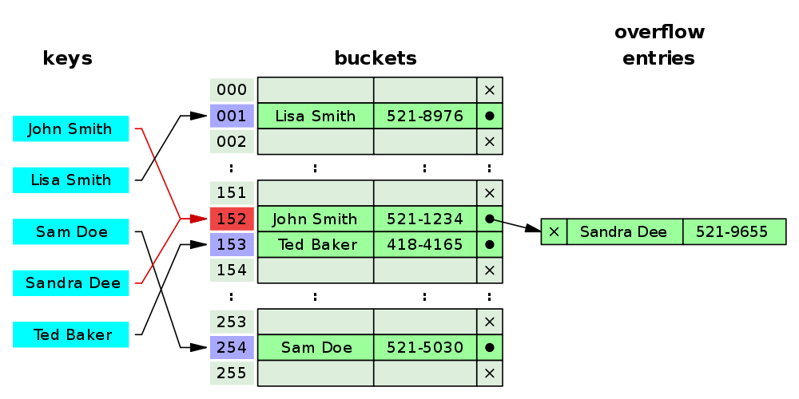

# Useful Computer Science Concepts

## Big O - Complexity and Performance
Briefly, Big O notation tells us how fast (or slow) an algorithm is. The
notation is clunky, but it's so commonly used that it's worth understanding.

We care about this concept because it allows us to concisely discuss performance.

| Big O    | Common name      | Example                                                 |
|----------|------------------|---------------------------------------------------------|
| O(1)     | Constant Time    | Accessing an element in an array                        |
| O(log n) | Logarithmic Time | Accessing an element in a tree                          |
| O(n)     | Linear Time      | Find an element in an array                             |
| O(n^2)   | Quadratic Time   | Sort an array with a naive algorithm (like bubble sort) |   

## Common operations
* Access - read or write a value
* Add element - put a new element into the collection without regard for order
* Insert element - put a new element into a specific place in an ordered collection
* Size - determine how many elements are in a collection
* Empty - determine if the collection has no elements (this is always as fast or faster than size==0)
* Search - find a specific element by 'name'
* Sort - put all elements of the collection in a specific order (or make a new sorted collection)

## Data Structures
### Array
Blob of memory that allows fast random access. You probably know how this works already.
### List
Collection of objects that are in the order they were added and can be randomly
accessed

#### Array List
A type of list that is implemented in terms of an array

#### [Linked List](https://en.wikipedia.org/wiki/Linked_list)
A list where the elements are represented as nodes that point to the 'next'
node in the list.

### Set
A collection where duplicate elements are not allowed. Typically, the duplicate
element is ignored when added.
### Hash Function
Hashing is commonly used in data structures where we want to look up values
using a key.

A hash function maps data of an arbitrary size to a fixed size value (called a
hash code). They always map the data to the same hash code. Hash codes allows
us to quickly determine if two objects are not equal because two objects that
are identical will have the same hash code. Hash tables use them to quickly locate
specific objects.

Note that two objects can have the same hash code and not be equal because hash codes
don't have the same number of bits as the source object.
```
Java Example

	@Override
	public int hashCode() {
		Object[] a = new Object[]{name, heading, x, y};
		if (a == null)
		    return 0;

		int result = 1;

		for (Object element : a)
		    result = 31 * result + (element == null ? 0 : element.hashCode());

		return result;
	}
```

### [Hash Table](https://en.wikipedia.org/wiki/Hash_table)
A hash table, also known as hash map, is a data structure that implements an
associative array or dictionary. It is an abstract data type that maps keys to values.

When we want to look up an object in a hash table, we use a specific hashing function
to compute that objects hash code. That hash code tells us which 'hash bucket' should contain
that object. We look in that hash bucket (which is usually implemented as a list), to find
the object that we are looking up. If the object has been added to the hash table then we
will find it in the correct bucket otherwise we can report that the object wasn't found.

We use a similar process to add an object to the hash table.


##### Note
In Java, HashMap is implemented using a HashTable and HashSet is implemented with a HashMap.
### Tree
A collection where elements are represented as nodes that have 'child' nodes.
Each tree has a unique 'root' node that gives a starting point for accessing
the tree.

#### Binary search tree
A common type of tree where each node has two children which are usually named
something like 'leftChild' and 'rightChild'. This tree is kept 'sorted' by
making nodes that are before the current node in the left sub-tree of that node.


### Map
A collection where values are associated with 'keys' that allow them to be
looked up. This works like looking up the definition of a word in a
dictionary or finding a house by its address. Think of the key as being a label
for the associated value.

